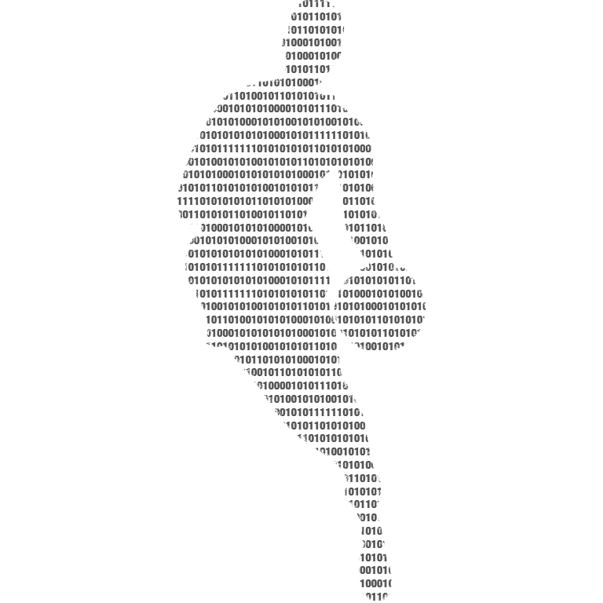

<h1 align="center">
  <a href="https://github.com/nrfrank/bas-2022-basketball-analytics-python">
    <!-- Please provide path to your logo here -->
    
  </a>
</h1>

<div align="center">
  BAS 2022 - Hands on Basketball Analytics with Python
  <br />
  <a href="#about"><strong>Explore the docs »</strong></a>
</div>

<div align="center"> <br /> </div>

<details open="open">
<summary>Table of Contents</summary>

- [About](#about)
- [Getting Started](#getting-started)
  - [Prerequisites](#prerequisites)
  - [Installation](#installation)
- [Usage](#usage)
- [License](#license)
- [Acknowledgements](#acknowledgements)

</details>

---

## About

This repository provides materials for the "How to Begin Your Journey: Hands on Basketball Analytics with Python" 
workshop at the [2022 Basketball Analytics Summit](https://www.basketballanalyticssummit.com/).


## Getting Started

### Prerequisites

This project requires a working Python installation and was developed using Python 3.9. A Python installation for your
environment can be downloaded from [Python downloads](https://www.python.org/downloads/) page. The 
[Python Beginner's Guide](https://wiki.python.org/moin/BeginnersGuide/Download) provides more detailed instructions. 
Alternatively, the [conda](https://docs.conda.io/projects/conda/en/latest/user-guide/install/index.html) package, 
dependency, and environment manager is a popular choice to ease the installation and management process.

### Installation

To get started with this workshop, clone the project locally.

```copy
git clone https://github.com/nrfrank/bas-2022-basketball-analytics-python.git
```

Next, create a Python virtual environment using either `venv`

```copy
python3 -m venv ./venv
source ./venv/bin/activate
```

or `conda`

```copy
conda create -n basketball-analytics-summit python=3.9
conda activate basketball-analytics-summit
```

Next, install the package and requirements

```copy
python -m pip install -e '.[dev]'
```

Finally, if you want to use Jupyter for exploration, reporting, and interactive testing, create a localized kernel for 
your active environment.

```copy
python -m ipykernel install --user --name basketball-analytics-summit --display-name "Basketball Analytics Summit (Python 3.9)"
```

## Usage

See documentation in the [tutorial](docs/tutorial.md).

## License

This project is distributed under the [**MIT License**](https://choosealicense.com/licenses/mit/).

See [LICENSE](LICENSE) for more information.

## Acknowledgements

[@d-flintosh](https://github.com/d-flintosh) contributed significantly to the shape and underlying methods used by this 
project.
